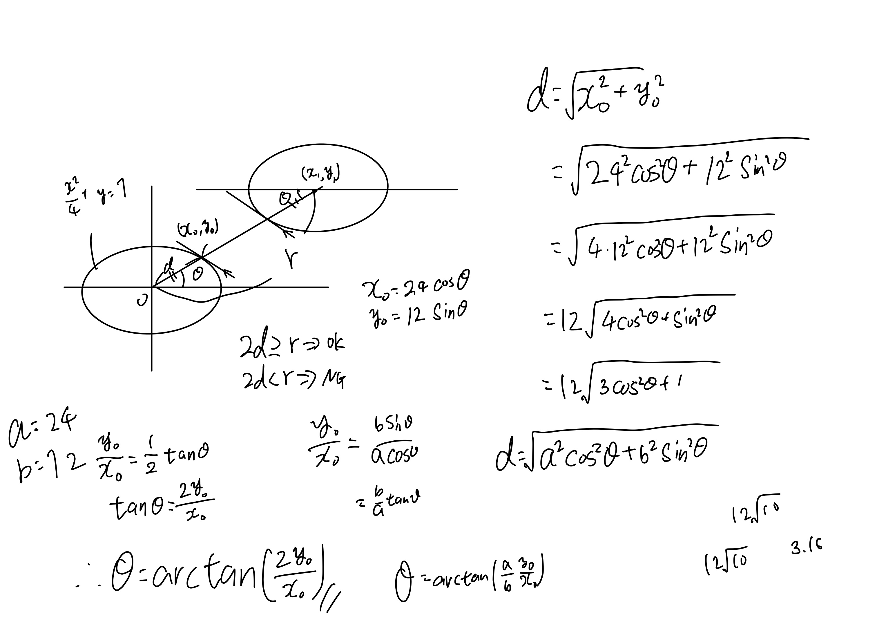

# 前書き
自分が所属する団体でハッカソンがあった。  
自分は参加しないつもりでいたのだがものつくりがしたくなり、今回はビジネス的な側面を気にしなくてもよさそうなので事前にこんなの作ればいいよという気持ちでスイカ割りをするゲームを作った。

# 制作物
- [Play](https://ravoratory.github.io/watermelon/)
- [Repository](https://github.com/ravoratory/watermelon)  


---

# 技術的なところ

自分がゲーム画面,共同作者の[miharun](https://github.com/fumiharun11)がダイアログなどのウィンドウを担当した。

## ライブラリについて

2D系のゲームだと[PixiJS](https://pixijs.com/)などがあるが、今回はcanvasだけの素で行くことにした。（実はライブラリの存在を知らなかった）

## 画面描画について

シンプルな構造のゲームにすることは決めていたのだが、かといって1画面になんでも詰め込むとコードがすごいことになるので最低限（オブジェクトとか背景とか）の分割描画は行うことにしている。


## 操作について

完全にJoyStickをイメージしてバーチャル的に作成した。JoyStickならば
- 倒す角度によって速度が変わる
- 離すと元の位置に戻る

ことが必須ゆえ、作成してみることにする。
mousemoveイベントの中にこんなのを入れる。
```js
const d = Math.sqrt(
    (CTRL_INIT_X - e.offsetX) ** 2 + (CTRL_INIT_Y - e.offsetY) ** 2
  );
  const rad = Math.atan2(e.offsetY - CTRL_INIT_Y, e.offsetX - CTRL_INIT_X);
  // stickはコントローラーの描画位置
  if (d >= CTRL_RADIUS - STICK_RADIUS) {// 規定の円よりも外側に描画させない
    [stick.x, stick.y] = [
      CTRL_INIT_X + (CTRL_RADIUS - STICK_RADIUS) * Math.cos(rad),
      CTRL_INIT_Y + (CTRL_RADIUS - STICK_RADIUS) * Math.sin(rad),
    ];
  } else {
    [stick.x, stick.y] = [e.offsetX, e.offsetY];
  }
  player.setSpeed(
    PLAYER_SPEED * (d / STICK_RADIUS) * Math.cos(rad),
    PLAYER_SPEED * (d / STICK_RADIUS) * Math.sin(rad)
  );
```
mouseupイベントにstickを元の位置に戻す処理をいれればコントローラーは9割型完成する。

## 当たり判定
楕円形の判定について調べると[こんな記事](http://marupeke296.com/COL_2D_No7_EllipseVsEllipse.html)がヒットするが、余計なことに時間を取られたくないので一旦長方形の当たり判定で妥協することにした。

```js
const canSplit = () => {
  // horizontal(横方向)にあたっているか
  const h =
    melon.x + 35 - 24 < player.x + 180 + 24 &&
    player.x + 180 - 24 < melon.x + 35 + 24;
  // vertical(縦方向)にあたっているか
  const v =
    melon.y + 60 - 12 < player.y + 180 + 12 &&
    player.y + 180 - 12 < melon.y + 60 + 12;
  return h && v;
};
```
実際こんなコードがPRで出されたら即rejectなレベルではあるのだが、やることが意外と貯まっていたので...

後になってこれを楕円形の当たり判定に修正した。

一般の楕円形については上の記事のようにめんどくさい処理が必要だが、ある並行軸の上で同型（数学的に正しい言い方ではないと思うが、要は平行移動で重なるような）な楕円形であれば単純な2点間の距離で判定することが可能なので、以下のようにできる。
```js
const canSplit = () => {
  const p = { x: player.x + 180, y: player.y + 180 };
  const m = { x: melon.x + 35, y: melon.y + 60 };
  const dif = { x: p.x - m.x, y: p.y - m.y };
  const r = Math.sqrt(dif.x ** 2 + dif.y ** 2);
  const rad = Math.atan2(2 * dif.y, dif.x);
  const d = 24 * Math.sqrt(1 + 3 * Math.cos(rad) ** 2);
  return d >= r;
};
```
このうち
```js
const rad = Math.atan2(2 * dif.y, dif.x);
const d = 24 * Math.sqrt(1 + 3 * Math.cos(rad) ** 2);
```
については解説が必要なので記述する。

楕円の式は以下の式で表されていた。

$\dfrac{x^2}{a^2} + \dfrac{y^2}{b^2} = 1$

そして楕円の周上のある点$P$は

$P = (a\cos\theta, b\sin\theta)$


といった議論を経て下の画像のようになる。~~めんどくなっちゃった~~


## 得点計算について
減点方式にした。100万点を基準としてどれだけ離れていたかを計算する。近ければ近いほど減点率を低くしたいので指数関数にした。
```js
const calcScore = () => {
  const playerShadowX = player.x + 180;
  const playerShadowY = player.y + 180;
  const melonShadowX = melon.x + 35;
  const melonShadowY = melon.y + 60;
  const d = Math.sqrt(// **2ではなくMath.powなのは多分書いた人間が違うから
    Math.pow(playerShadowX - melonShadowX, 2) +
      Math.pow(2 * (playerShadowY - melonShadowY), 2)
  );
  // この18は好ましい得点の出方になるように調整した結果
  return Math.exp(-Math.pow(d / 18, 2)) * Math.pow(10, 6);
};
```